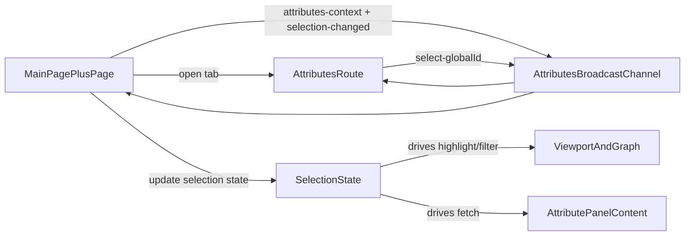

# Rename Selection Panel to Attribute Pop-out

## Goal

Replace the in-canvas `SelectionPanel` overlay with an `Attribute` panel that opens in a separate browser tab, while preserving all current element-detail behavior (selection updates, relation navigation, and branch/revision context).

## Current Baseline

- Main page mounts `SelectionPanel` in viewport/graph contexts in `[/home/jovin/projects/BimAtlas/apps/web/src/routes/+page.svelte](/home/jovin/projects/BimAtlas/apps/web/src/routes/+page.svelte)`.
- Panel UI + data fetch currently live together in `[/home/jovin/projects/BimAtlas/apps/web/src/lib/ui/SelectionPanel.svelte](/home/jovin/projects/BimAtlas/apps/web/src/lib/ui/SelectionPanel.svelte)`.
- Shared selection/branch/revision state comes from `[/home/jovin/projects/BimAtlas/apps/web/src/lib/state/selection.svelte.ts](/home/jovin/projects/BimAtlas/apps/web/src/lib/state/selection.svelte.ts)`.
- Existing pop-out pattern already exists for Search (`window.open` + `BroadcastChannel`) in `[/home/jovin/projects/BimAtlas/apps/web/src/routes/+page.svelte](/home/jovin/projects/BimAtlas/apps/web/src/routes/+page.svelte)` and `[/home/jovin/projects/BimAtlas/apps/web/src/routes/search/+page.svelte](/home/jovin/projects/BimAtlas/apps/web/src/routes/search/+page.svelte)`.

## Implementation Plan

1. **Define an attributes cross-window protocol**

- Add an attributes channel constant and typed message union (request context, context payload, selection changed, close panel signal) in a new protocol module under `src/lib/attributes/`.
- Mirror the structure used by the search protocol so both windows can stay type-safe.

1. **Separate panel content from panel shell**

- Extract reusable detail-rendering/fetch logic from `SelectionPanel.svelte` into an `AttributePanelContent` component (or equivalent) that does not assume absolute overlay positioning.
- Rename visible copy from “Selected Element” to “Attribute Panel” (and any supporting labels where needed).

1. **Create the pop-out Attributes route**

- Add `apps/web/src/routes/attributes/+page.svelte`.
- Render the new Attribute content as full-page tab content (no overlay `<aside>` positioning).
- On mount: connect to attributes `BroadcastChannel`, request current context from the opener, and hydrate with `branchId`, `revision`, and `activeGlobalId`.
- Handle delayed context arrival/retry similarly to search popup behavior.

1. **Wire main page to open/focus the attribute tab**

- In `+page.svelte`, replace embedded `<SelectionPanel />` mounts with an “Attributes” open/focus action (toolbar button and/or auto-open-on-select behavior per current UX target).
- Keep a `Window | null` handle for the attributes tab and open via `window.open('/attributes?...')`.
- Publish selection/context changes over the attributes channel whenever `activeGlobalId`, active branch, or active revision changes.

1. **Support two-way interactions from pop-out**

- When a user clicks relation links in the attributes tab, send message(s) back to main window to update `selection.activeGlobalId`.
- Keep close semantics consistent (closing in popup clears selection only if that matches current behavior; otherwise just closes the tab view).

1. **Cleanup and naming migration**

- Rename component/file symbols from `SelectionPanel` to `AttributePanel` where appropriate.
- Remove obsolete overlay-specific CSS (`position: absolute`, anchored right panel styles) from the main page path.
- Preserve reusable typography/list styles inside the pop-out page/component.

1. **Verification**

- Manual checks:
  - Selecting an element in viewport/graph updates the pop-out panel.
  - Branch/revision switches refresh displayed attributes correctly.
  - Relation/type/container link clicks in popup re-select and re-highlight in main viewport.
  - Re-opening focuses existing attributes tab instead of spawning duplicates.
- Run frontend checks (`pnpm run check`) and fix any introduced type/a11y issues in touched files.

## Data Flow (target)

## Files to Touch (expected)

- `[/home/jovin/projects/BimAtlas/apps/web/src/routes/+page.svelte](/home/jovin/projects/BimAtlas/apps/web/src/routes/+page.svelte)`
- `[/home/jovin/projects/BimAtlas/apps/web/src/lib/ui/SelectionPanel.svelte](/home/jovin/projects/BimAtlas/apps/web/src/lib/ui/SelectionPanel.svelte)` (rename/refactor target)
- `[/home/jovin/projects/BimAtlas/apps/web/src/routes/attributes/+page.svelte](/home/jovin/projects/BimAtlas/apps/web/src/routes/attributes/+page.svelte)` (new)
- `[/home/jovin/projects/BimAtlas/apps/web/src/lib/attributes/protocol.ts](/home/jovin/projects/BimAtlas/apps/web/src/lib/attributes/protocol.ts)` (new)
