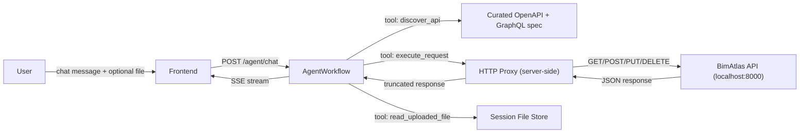

# Direct API Calling Agent

## Motivation

The current `execute_code` tool runs AI-generated Python via `subprocess.Popen` on the host -- a designed-in RCE vulnerability. Rather than moving to Docker warm pools (high infrastructure complexity), we adopt the "two-tool" pattern: `discover_api` (already exists) + a new `execute_request` tool that makes HTTP requests against the BimAtlas API on the agent's behalf. This covers ~80% of use cases (lookup, update, audit) with zero sandbox infrastructure and no security risk.

## Architecture



The agent has these tools after the refactor:

| Tool                  | Purpose                                                      | Status     |
| --------------------- | ------------------------------------------------------------ | ---------- |
| `discover_api`        | Return curated API contract (REST + GraphQL examples)        | Keep as-is |
| `execute_request`     | Make HTTP request to BimAtlas API, return truncated response | **New**    |
| `list_uploaded_files` | List user-uploaded files in session                          | Keep as-is |
| `read_uploaded_file`  | Read/extract text from uploaded files (PDF, CSV, etc.)       | Keep as-is |
| `execute_code`        | Run Python in subprocess sandbox                             | **Remove** |
| `list_artifacts`      | List sandbox-generated files                                 | **Remove** |
| `read_artifact`       | Read sandbox-generated file                                  | **Remove** |

## Changes by File

### [apps/api/src/services/agent/sandbox_tools.py](apps/api/src/services/agent/sandbox_tools.py)

**Add** `execute_request` function:

```python
def execute_request(
    method: str,
    endpoint: str,
    payload: dict | None = None,
    query_params: dict | None = None,
    description: str = "",
) -> dict[str, Any]:
    """Execute an HTTP request against the BimAtlas API.

    The request is made server-side. Auth tokens are injected automatically.
    Large responses are truncated to avoid context window overflow.
    """
    method = method.upper()
    if method not in {"GET", "POST", "PUT", "PATCH", "DELETE"}:
        raise ValueError(f"Unsupported method: {method}")
    if not endpoint.startswith("/"):
        raise ValueError("endpoint must start with /")

    base_url = os.environ.get("BIMATLAS_API_URL", "http://localhost:8000")
    url = f"{base_url}{endpoint}"

    with httpx.Client(timeout=30) as client:
        resp = client.request(method, url, json=payload, params=query_params)

    body = resp.text
    truncated = len(body) > MAX_RESPONSE_CHARS
    result = {
        "status_code": resp.status_code,
        "body": body[:MAX_RESPONSE_CHARS] if truncated else body,
        "truncated": truncated,
        "description": description,
    }
    if truncated:
        result["notice"] = (
            f"Response truncated at {MAX_RESPONSE_CHARS} chars. "
            "Use query params like ?limit=10 or GraphQL field selection to reduce payload."
        )
    return result
```

`MAX_RESPONSE_CHARS = 50_000` constant at module level.

**Remove** `execute_code`, `list_artifacts`, `read_artifact` functions.

**Update** `get_sandbox_tools` (rename to `get_api_tools`): return `discover_api`, `execute_request`, `list_uploaded_files`, `read_uploaded_file` -- four tools instead of six.

**Add** `httpx` and `os` imports. Remove `sandbox_manager` import for execute/artifact operations (keep for file read/list).

### [apps/api/src/services/agent/sandbox.py](apps/api/src/services/agent/sandbox.py)

**Strip down** to a session file store only. Remove:

- `execute()` method and all subprocess/resource-limit logic
- `_set_resource_limits()` helper
- `_validate_code()` AST validation
- `list_artifacts()`, `read_artifact()`, `get_artifact_path()` methods
- `resource`, `subprocess`, `sys`, `ast` imports
- `FORBIDDEN_IMPORTS`, `FORBIDDEN_CALL_NAMES` constants
- `ExecutionResult` dataclass

Keep:

- `save_upload()`, `list_uploads()`, `read_upload()` methods
- `cleanup_session()`, `cleanup_expired_sessions()` methods
- File validation helpers (`_validate_session_id`, `_sanitize_filename`, `_safe_join`)
- Upload extension and size constants

The class can be renamed to `SessionFileStore` (with `sandbox_manager` alias kept for backward compatibility with `main.py` imports).

### [apps/api/src/services/agent/workflow.py](apps/api/src/services/agent/workflow.py)

**Update system prompt** (lines 25-48) -- remove sandbox/artifact references:

```python
SYSTEM_PROMPT = """\
You are the BimAtlas Technical Agent, an autonomous data analyst and automation
engineer for BIM/IFC projects.

You can:
- Discover the API contract dynamically (`discover_api`)
- Read user-uploaded files (`list_uploaded_files`, `read_uploaded_file`)
- Call any BimAtlas API endpoint directly (`execute_request`)
- Use fast-path IFC filter tools for simple filter requests

## Working policy
1. If files are attached, inspect them first with `list_uploaded_files` and
   `read_uploaded_file`.
2. Call `discover_api` before making REST/GraphQL API requests you haven't
   used yet in this conversation.
3. Use `execute_request` to call endpoints. For GraphQL, POST to `/graphql`
   with a JSON body containing `query` and optional `variables`.
4. Always use pagination (`?limit=10`) or GraphQL field selection to keep
   responses small. Never fetch unbounded lists.
5. For straightforward filter operations, prefer direct filter tools.
6. Do not invent API fields or mutation names. Use discovered contract details.
7. Be concise and include a clear summary of actions taken.
"""
```

**Update import** (line 21): change `get_sandbox_tools` to `get_api_tools`.

**Remove artifact SSE emission** (lines 208-222): delete the `execute_code` artifact detection block in `ToolCallResult` handling.

### [apps/api/src/main.py](apps/api/src/main.py)

**Remove** the `/agent/artifacts/{session_id}/{filename}` endpoint (lines 528-547).

**Remove** `FileResponse` import (if no longer used elsewhere).

**Keep** `POST /agent/upload` endpoint, `_sandbox_cleanup_loop`, and lifespan cleanup task as-is (still needed for uploaded file cleanup).

### [apps/web/src/lib/agent/protocol.ts](apps/web/src/lib/agent/protocol.ts)

**Remove** the `artifact` variant from `AgentSSEEvent` union (line 52):

```typescript
export type AgentSSEEvent =
  | { type: "thinking"; content: string }
  | {
      type: "tool_call";
      name: string;
      arguments: Record<string, unknown>;
      result?: string;
    }
  | { type: "message"; content: string }
  | { type: "error"; content: string }
  | { type: "done" };
```

### [apps/web/src/lib/agent/ChatPanel.svelte](apps/web/src/lib/agent/ChatPanel.svelte)

**Remove** artifact SSE handling blocks. There are two instances (one in `sendMessage` around line 544, one in the chat-history replay path around line 789). In both cases, remove the `const artifacts` array, the `else if (event.type === "artifact")` block, and references to `artifacts` in the final message update. The `attachments` field on messages still exists for user-uploaded file chips (those come from the upload flow, not SSE artifacts).

### [apps/api/pyproject.toml](apps/api/pyproject.toml)

**Add** `httpx>=0.28.1` to dependencies (already listed but confirm it's available at runtime, not just dev).

### Tests

**[apps/api/tests/test_sandbox_manager.py](apps/api/tests/test_sandbox_manager.py)**: Remove `test_sandbox_execute_generates_artifact` (tests subprocess execution). Keep `test_sandbox_upload_type_validation`. Add test for `execute_request` tool (mock `httpx.Client` to verify truncation, method validation, endpoint prefix enforcement).

**[apps/api/tests/test_agent_api_sandbox.py](apps/api/tests/test_agent_api_sandbox.py)**: Remove `test_agent_artifact_download_serves_generated_file` and `test_agent_chat_stream_includes_artifact_event`. Add `test_execute_request_returns_truncated_response` and `test_execute_request_rejects_invalid_method`.

## What This Does NOT Support

- **Generating downloadable files** (CSVs, reports): The agent can format data inline in chat but cannot write files. If this becomes a need, a lightweight "render response as file" endpoint can be added later without a sandbox.
- **Multi-step computation** (pagination loops, data joins across endpoints): Each API call requires an LLM round-trip. API design should favor pre-aggregated endpoints and strong pagination defaults.
- **Arbitrary code execution**: Intentionally removed. The agent operates strictly through the API surface.
