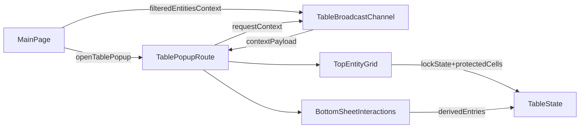

# Filtered Entities Table View Plan

## Objective

Add a new main-page button (parallel to Graph) that opens a popup tab showing the currently filtered IFC entities in a dynamic table, with row lock/unlock controls, protected IFC columns (for example `IfcClass`), and a lower sheet-like segment for user interactions (for example quantity surveying notes/calcs). Include an explicit go/no-go decision on Univer.

## Recommended Technical Direction

- Implement v1 with a Svelte-native table architecture first, and keep a clean adapter boundary so Univer can be swapped in later.
- Rationale from repo investigation:
  - Current frontend is SvelteKit + Vite and already uses popup-tab + BroadcastChannel patterns.
  - Univer is not currently installed and would likely add substantial dependency weight and framework mismatch overhead (React/ReactDOM/RxJS stack).
  - The requested capabilities can be delivered incrementally with lower risk by composing existing state + protocol patterns.

## Scope and Artifacts

- Create a new product feature directory: [.cursor/product/features/feature_003_filtered_entities_table_view/](.cursor/product/features/feature_003_filtered_entities_table_view/)
- Create/update planning artifacts in that directory:
  - [prd.md](.cursor/product/features/feature_003_filtered_entities_table_view/prd.md)
  - [lessons_learned.md](.cursor/product/features/feature_003_filtered_entities_table_view/lessons_learned.md)
  - [active_task.json](.cursor/product/features/feature_003_filtered_entities_table_view/active_task.json)

## Implementation Plan

1. Define PRD and acceptance boundaries for this feature in [prd.md](.cursor/product/features/feature_003_filtered_entities_table_view/prd.md):

- Main-page `Table` button behavior and popup lifecycle.
- Data source = current filtered entities from `searchState.products` (the actual streamed result set).
- Lock model (`locked`/`unlocked`) and protected columns (`IfcClass` always read-only).
- Split layout requirements: top entity table, bottom sheet interaction area.
- Export requirements: single-click `.csv` export of the full table state combining top-grid entity columns and bottom-sheet interaction columns/values.
- Out-of-scope guardrails for v1 (no backend persistence unless explicitly required).

1. Seed feature constraints in [lessons_learned.md](.cursor/product/features/feature_003_filtered_entities_table_view/lessons_learned.md), including inherited hard constraints:

- UUID identifiers are strings across API/UI state.
- Geometry payload remains opaque/non-tabular (no BYTEA handling in table feature).
- Use the current filtered stream output as source-of-truth rather than re-evaluating filter logic in popup.

1. Initialize [active_task.json](.cursor/product/features/feature_003_filtered_entities_table_view/active_task.json) with:

- `status: ready_for_execution`
- `feature_id`
- concise `feature_description` aligned with product overview + PRD
- execution checklist tied to this plan.

1. Add popup entry point on main page in [apps/web/src/routes/+page.svelte](apps/web/src/routes/+page.svelte):

- Add `Table` action button next to existing Graph/Search/Attributes actions.
- Implement `openTablePopup()` following existing popup conventions (URL params + context sync handshake).
- Ensure popup opens non-blocking and can recover context on refresh/reopen.

1. Add table popup protocol module in [apps/web/src/lib/table/protocol.ts](apps/web/src/lib/table/protocol.ts):

- Define BroadcastChannel name and typed messages (`context`, `request-context`, `selection-changed`, and table-specific state updates as needed).
- Include versioned payload shape for future compatibility.

1. Create table popup route in [apps/web/src/routes/table/+page.svelte](apps/web/src/routes/table/+page.svelte):

- Bootstrap from URL query (`projectId`, `branchId`, `revisionId`, optional selected entity).
- Request/sync context via protocol channel.
- Render split layout container (top grid + bottom sheet panel).
- Add export CTA in the existing top-segment toolbar container (`div.segment-toolbar`) so it appears alongside existing controls (`Total entities`, `Find selected element`, `Lock all`, `Add column`, `Formula guide`).

1. Implement top segment entity grid component(s) under [apps/web/src/lib/table/](apps/web/src/lib/table/):

- Consume filtered entities from synchronized payload/state (`searchState.products` sourced from main window).
- Add lock/unlock toggle per row/entity.
- Enforce protected-cell policy (e.g., `IfcClass` non-editable; optionally other immutable identity fields).
- Add sorting/filtering/pagination/virtualization strategy sized for large IFC sets.

1. Implement bottom segment sheet-interaction component under [apps/web/src/lib/table/](apps/web/src/lib/table/):

- Start with lightweight interaction model (derived columns, ad-hoc notes/quantity formulas, row references).
- Keep data contract explicit so this segment can migrate to Univer later if needed.
- Define state persistence strategy for v1 (session/local only unless PRD calls for backend persistence).

1. Implement full-table CSV export (grid + bottom sheet):

- Add an `Export CSV` button in toolbar DOM path context:
  - `div[0] > div.table-page > ... > section.table-segment.table-segment-top > div.segment-toolbar`
  - Reference element observed: `
Total entities: 73 Find selected element Lock all Add column Formula guide
`
  - Target placement: same toolbar row (top segment), visible with existing controls.
- Export must serialize the entire currently loaded table model, not just selected rows:
  - Base columns from entity grid (including protected fields like `IfcClass`).
  - User-created/derived columns and row values from bottom-sheet interaction state.
  - Stable deterministic header order (entity identity fields first, then user/derived columns).
- Normalization rules:
  - Use CSV-safe escaping/quoting for commas, quotes, and multiline cell content.
  - Emit UTF-8 text and trigger browser download with `.csv` extension.
  - Preserve display value for formula/derived cells (and optionally include raw formula in a secondary column only if already represented in UI state).
- Name file predictably using context (for example project/revision + timestamp), e.g. `filtered-entities-<revisionId>-<yyyyMMdd-HHmm>.csv`.

1. Add a `TableEngine` adapter boundary in [apps/web/src/lib/table/engine.ts](apps/web/src/lib/table/engine.ts):

- Provide a Svelte-native default implementation.
- Reserve an optional `UniverEngine` integration path behind dynamic import/feature flag.
- This keeps the Univer decision reversible without rewriting popup wiring.

1. Timebox Univer feasibility spike and decision (1 execution step):

- Prototype route-local dynamic import in popup-only context.
  - Measure cold-start impact, memory footprint, and integration complexity.
  - Compare against acceptance targets; record decision and evidence in feature docs.
  - Expected default decision: defer Univer unless advanced spreadsheet requirements materially exceed lightweight implementation.

1. Add isolated tests and verification for spreadsheet features:

- Build a dedicated Playwright spec suite with deterministic dummy data fixtures (no dependency on live IFC streaming) under [apps/web/tests/table-spreadsheet/](apps/web/tests/table-spreadsheet/).
- Cover spreadsheet-focused behaviors: split top/bottom segments, lock/unlock transitions, protected-cell enforcement (`IfcClass` uneditable), and bottom-sheet interaction edits/calculations.
- Add CSV export checks:
  - `Export CSV` button renders in top segment toolbar and remains enabled when data is present.
  - Download payload includes both top-grid and bottom-sheet columns for the same exported row set.
  - CSV escaping handles commas/quotes/newlines correctly.
- Add a test harness entry mode (query flag, fixture injection, or mocked channel payload) so popup rendering can be validated in isolation from backend/network variability.
- Add npm scripts in [apps/web/package.json](apps/web/package.json) for both:
  - default CI/headless run
  - headed Chromium run so users can watch edits happen live (for example Playwright `--headed --project=chromium` path).
- Update run instructions in [README.md](README.md) with exact commands for both modes and any prerequisites.
- Final verification step: run web checks (`pnpm run check`) and run the isolated Playwright suite in headless + headed Chromium modes, then update feature artifact statuses/handoff notes.

## Data/Interaction Flow

## Univer Decision Criteria (Go/No-Go)

- Go with Univer only if all are true:
  - Required spreadsheet behaviors cannot be met acceptably with lightweight grid + formulas.
  - Popup-only lazy loading keeps startup/perf within acceptable limits.
  - Dependency/maintenance overhead is acceptable for Svelte-first architecture.
- Otherwise: ship Svelte-native table + interaction panel and keep Univer as phase-2 option via adapter.
