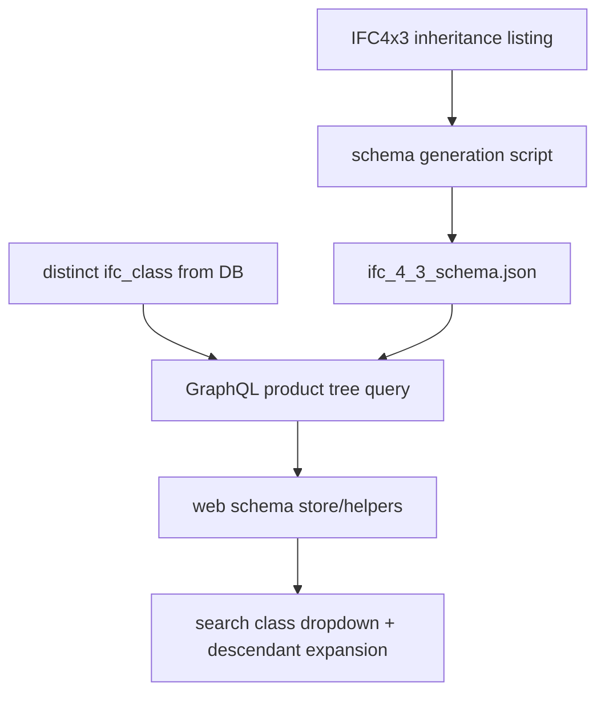

# Implement IFC4x3 Schema + DB-Backed Product Tree

## Scope

- Build a **full IFC4x3** schema artifact at `[apps/api/schema/ifc_4_3_schema.json](apps/api/schema/ifc_4_3_schema.json)`.
- Replace hardcoded frontend product tree in `[apps/web/src/lib/ifc/schema.ts](apps/web/src/lib/ifc/schema.ts)` with data loaded from backend (derived from DB classes + IFC inheritance).

## Backend Work

- Add a schema generation script (new file under `[apps/api/scripts/](apps/api/scripts/)`) that:
  - Uses IFC4x3 inheritance listing (Annex inheritance structure) to build parent/child links.
  - Writes each entity with: `abstract`, `parent`, `attributes[]` where each attribute has `name`, `type`, `required`.
  - Preserves IFC attribute order and stores declared attributes at each level so full attributes can be resolved parent→child.
- Add schema-loading utility in API (new module under `[apps/api/src/schema/](apps/api/src/schema/)`) to:
  - Load `ifc_4_3_schema.json` once.
  - Resolve descendants and ordered full-attribute sets via recursive parent traversal.
- Add DB helper in `[apps/api/src/db.py](apps/api/src/db.py)` to fetch distinct IFC classes at a branch/revision (for real model-backed tree generation).
- Add GraphQL type/query in `[apps/api/src/schema/ifc_types.py](apps/api/src/schema/ifc_types.py)` and `[apps/api/src/schema/queries.py](apps/api/src/schema/queries.py)`:
  - Return a product tree rooted at `IfcProduct`, pruned to classes present in DB for the selected branch/revision.
  - Keep hierarchy correctness from the IFC schema JSON (not inferred heuristically).

## Frontend Work

- Extend `[apps/web/src/lib/api/client.ts](apps/web/src/lib/api/client.ts)` with a query for the backend product tree.
- Refactor `[apps/web/src/lib/ifc/schema.ts](apps/web/src/lib/ifc/schema.ts)` to:
  - Stop shipping hardcoded `IFC_PRODUCT_TREE` as primary source.
  - Build `flattenTree` / `getDescendantClasses` from fetched hierarchy data.
  - Keep a safe fallback for unavailable API responses.
- Wire usage in `[apps/web/src/lib/ui/SearchFilter.svelte](apps/web/src/lib/ui/SearchFilter.svelte)` and `[apps/web/src/routes/+page.svelte](apps/web/src/routes/+page.svelte)` so class filter dropdown + descendant expansion use dynamic tree data.

## Validation and Tests

- Backend tests:
  - Add/extend tests in `[apps/api/tests/test_api.py](apps/api/tests/test_api.py)` for the new hierarchy query.
  - Add tests in `[apps/api/tests/](apps/api/tests/)` for schema loader recursion (descendants + ordered full attributes + required flags).
- Frontend checks:
  - Ensure class dropdown still renders and descendant filtering still expands correctly.
- Run relevant API and web test/check commands after implementation.

## Data Flow

## Key implementation rules to preserve

- Mark abstract entities explicitly (`abstract: true/false`).
- Preserve IFC declared attribute order.
- Resolve full attribute set by appending child attributes after parent attributes recursively.
- Use required/optional metadata to support validator behavior across schema versions.
