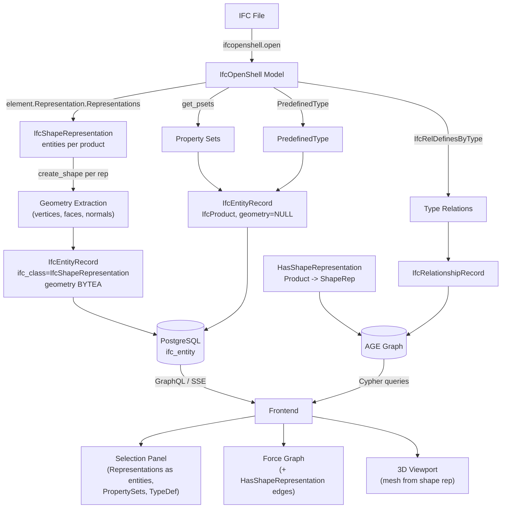

# IFC Representation Relations: Ingestion Audit and Frontend Refactor

## Current State Analysis

### Geometry Extraction (Already Correct)

The backend in `[apps/api/src/services/ifc/geometry.py](apps/api/src/services/ifc/geometry.py)` uses `ifcopenshell.geom.iterator()` which **internally resolves** the full IFC representation chain:

```
IfcProduct.Representation -> IfcProductDefinitionShape -> IfcShapeRepresentation -> IfcRepresentationItem
```

This means geometry _is_ being extracted correctly from IfcShapeRepresentation -- ifcopenshell abstracts away the traversal. No change needed for the core mesh extraction.

### Identified Gaps

#### Backend Gaps

1. **IfcShapeRepresentation not stored as entities.** Geometry is currently stored directly on IfcProduct rows. Per IFC 4.3, geometry lives in IfcShapeRepresentation (via IfcProductDefinitionShape.Representations). IfcShapeRepresentation should be first-class entities in `ifc_entity` with their own rows and graph nodes; geometry should reside on the shape rep, not the product.
2. **Missing Product -> ShapeRepresentation relationship.** The graph has no edge linking IfcProduct to its IfcShapeRepresentation entities. Need `HasShapeRepresentation` (or equivalent) edges.
3. **Missing `IfcRelDefinesByType` relationship.** The ingestion extracts 5 relationship types but omits `IfcRelDefinesByType`, which links element instances (e.g., IfcWall) to their type definitions (e.g., IfcWallType).
4. **Missing `PredefinedType` attribute.** Entity-specific attributes like `PredefinedType` (e.g., `SOLIDWALL`, `PARTITIONING`, `SHEAR`) are not extracted.
5. **No property set data.** IFC property sets like `Pset_WallCommon` are not ingested into the `attributes` JSONB column.

#### Frontend Gaps

1. **Force graph only shows spatial tree.** The `graphStore.svelte.ts` only fetches `SPATIAL_TREE_QUERY` and flattens it into nodes/links with only `IfcRelAggregates` and `IfcRelContainedInSpatialStructure` edges. Element-level relationships (IfcRelVoidsElement, IfcRelFillsElement, IfcRelConnectsElements) are absent from the graph, even though the backend graph has them.
2. **Selection panel lacks type/property data.** The panel shows Class, GlobalId, Name, Description, ObjectType, Tag, Container, and Relations, but has no section for PredefinedType, type definitions, representation types, or property sets.

---

## Plan

### Phase 1: Backend -- IfcShapeRepresentation as First-Class Entities

**File:** `[apps/api/src/services/ifc/geometry.py](apps/api/src/services/ifc/geometry.py)`

- **Refactor geometry extraction:** Instead of attaching geometry to IfcProduct records, iterate over `element.Representation.Representations` (list of IfcShapeRepresentation) for each IfcProduct. For each IfcShapeRepresentation that has mesh/tessellation geometry, create a separate `IfcEntityRecord` with:
  - `ifc_class`: `"IfcShapeRepresentation"`
  - `ifc_global_id`: synthetic ID (e.g. `{product_gid}_Shape_{repr_identifier}_{index}`) since IfcShapeRepresentation has no native GlobalId
  - `attributes`: `{"RepresentationIdentifier": ..., "RepresentationType": ..., "OfProduct": product_gid}`
  - `geometry`: packed mesh buffers (vertices, normals, faces, matrix) from `ifcopenshell.geom.create_shape(settings, rep)` or equivalent
- **Remove geometry from IfcProduct records:** IfcProduct rows for geometric elements should have `geometry: None`; geometry lives only on IfcShapeRepresentation entities.
- **Preserve backward compatibility:** The geom.iterator may return one shape per product; map that to the "Body" representation when creating shape rep entities. Investigate ifcopenshell API for per-representation shape creation.
- **Synthetic IDs:** IfcShapeRepresentation has no GlobalId in IFC. Use `{product_gid}_Shape_{repr_identifier}_{index}` (e.g. `2O2Fr$t4X7Zf8NO7$sM0e_Shape_Body_0`) to ensure uniqueness. The existing `ifc_entity` table is reused; no schema migration needed.

**File:** `[apps/api/src/services/ifc/ingestion.py](apps/api/src/services/ifc/ingestion.py)`

- Add `HasShapeRepresentation` relationship extraction: for each IfcProduct with Representation, create `IfcRelationshipRecord(from_global_id=product_gid, to_global_id=shape_rep_id, relationship_type="HasShapeRepresentation")` for each of its IfcShapeRepresentation entities.
- Ensure IfcShapeRepresentation records are included in the product diff/insert flow and get graph nodes created (labeled `IfcShapeRepresentation`).

### Phase 2: Backend -- Add IfcRelDefinesByType to Graph

**File:** `[apps/api/src/services/ifc/ingestion.py](apps/api/src/services/ifc/ingestion.py)`

- Add a new block in `_extract_relationships()` for `IfcRelDefinesByType`:
  - For each `IfcRelDefinesByType` instance, extract `rel.RelatingType.GlobalId` and each `rel.RelatedObjects[*].GlobalId`.
  - Create `IfcRelationshipRecord(from_global_id=element_gid, to_global_id=type_gid, relationship_type="IfcRelDefinesByType")`.
- The graph node for the type object (e.g., IfcWallType) must also exist. Verify that type objects with geometry are picked up by the `ifcopenshell.geom.iterator()`. If not (types without geometry are common), add them as spatial-like records in `_extract_spatial_elements()` or a new `_extract_type_objects()` function.

**File:** `[apps/api/src/schema/ifc_enums.py](apps/api/src/schema/ifc_enums.py)`

- Add `HAS_SHAPE_REPRESENTATION = "HasShapeRepresentation"` for the Product -> ShapeRep edge (not a standard IFC relationship but maps to the representation chain).
- `REL_DEFINES_BY_TYPE` already exists.

### Phase 3: Backend -- Expose New Data via GraphQL

**File:** `[apps/api/src/schema/ifc_types.py](apps/api/src/schema/ifc_types.py)`

- Add new type `IfcShapeRepresentation` with `global_id`, `representation_identifier`, `representation_type`, `mesh` (optional).
- Add optional fields to `IfcProduct`:
  - `predefined_type: Optional[str]`
  - `representations: list[IfcShapeRepresentation]` — resolved via HasShapeRepresentation graph edges (or DB join)
  - `property_sets: Optional[strawberry.scalars.JSON]`
- Keep `mesh` on `IfcProduct` for backward compatibility: resolve by fetching the related IfcShapeRepresentation with identifier "Body" (or first available) and returning its geometry.

**File:** `[apps/api/src/schema/queries.py](apps/api/src/schema/queries.py)`

- Update `_row_to_product()`: `mesh` resolves from the product's related IfcShapeRepresentation entity (Body or first with geometry), not from the product row. Add `representations` by querying shape rep entities linked via HasShapeRepresentation.
- Update `row_to_stream_product()`: for each product, fetch mesh from its related IfcShapeRepresentation (Body) entity; products with no shape rep have no mesh. Use batch fetch (e.g. `fetch_shape_reps_for_products(product_gids, rev, branch_id)`) to avoid N+1 in the stream.

**File:** `[apps/api/src/db.py](apps/api/src/db.py)` (or equivalent)

- Add `fetch_shape_representations_for_product(product_global_id, rev, branch_id)` and `fetch_shape_reps_for_products(product_gids, rev, branch_id)` to return IfcShapeRepresentation rows. Resolve links via graph query (HasShapeRepresentation edge) or via `attributes->>'OfProduct'` if stored on shape rep rows.

### Phase 4: Frontend -- Enrich Force Graph with Element Relations

**File:** `[apps/web/src/lib/graph/graphStore.svelte.ts](apps/web/src/lib/graph/graphStore.svelte.ts)`

- After fetching the spatial tree, issue a second query for each contained element to fetch its `relations` (which include IfcRelVoidsElement, IfcRelFillsElement, IfcRelConnectsElements, IfcRelDefinesByType from the graph).
- **Alternative (preferred):** Create a new backend GraphQL query `elementRelations(branchId, revision)` that returns all non-spatial graph edges in one call (to avoid N+1). Add the returned edges to `graphData.links` and ensure their endpoint nodes exist in `graphData.nodes`.
- Add color coding for edge types in `ForceGraph.svelte` (different colors for voids, fills, connects, type-defines).

### Phase 5: Frontend -- Enrich Selection Panel

**File:** `[apps/web/src/lib/ui/SelectionPanel.svelte](apps/web/src/lib/ui/SelectionPanel.svelte)`

- Update the `ProductData` interface to include `predefinedType`, `representations` (array of `IfcShapeRepresentation` with `globalId`, `representationIdentifier`, `representationType`, optional `mesh`), and `propertySets`.
- Add UI sections to display:
  - **PredefinedType** badge below Class (e.g., "SOLIDWALL").
  - **Representations** list showing each IfcShapeRepresentation as an entity (identifier, type, link to select/navigate). Each representation is a first-class entity with its own globalId.
  - **Property Sets** collapsible section rendering key-value pairs from Pset_WallCommon, etc.
  - **Type** link showing the associated IfcWallType (navigable via the IfcRelDefinesByType relation).

**File:** `[apps/web/src/lib/api/client.ts](apps/web/src/lib/api/client.ts)`

- Update `IFC_PRODUCT_QUERY` to request the new fields (`predefinedType`, `representations { globalId representationIdentifier representationType }`, `propertySets`). Mesh continues to resolve on the product (from Body shape rep) for 3D rendering; representations list is for metadata/navigation.

---

## Data Flow (After Changes)



## Key Files to Modify

**Backend:**

- `[apps/api/src/services/ifc/geometry.py](apps/api/src/services/ifc/geometry.py)` -- IfcShapeRepresentation entity extraction, geometry on shape reps
- `[apps/api/src/services/ifc/ingestion.py](apps/api/src/services/ifc/ingestion.py)` -- HasShapeRepresentation + IfcRelDefinesByType
- `[apps/api/src/services/graph/age_client.py](apps/api/src/services/graph/age_client.py)` -- query for shape reps by product (e.g. `get_shape_representations`)
- `[apps/api/src/services/graph/queries.py](apps/api/src/services/graph/queries.py)` -- Cypher template for HasShapeRepresentation
- `[apps/api/src/db.py](apps/api/src/db.py)` -- fetch shape rep entities by global_id
- `[apps/api/src/schema/ifc_types.py](apps/api/src/schema/ifc_types.py)` -- IfcShapeRepresentation type, representations on IfcProduct
- `[apps/api/src/schema/ifc_enums.py](apps/api/src/schema/ifc_enums.py)` -- HasShapeRepresentation, IfcRelDefinesByType
- `[apps/api/src/schema/queries.py](apps/api/src/schema/queries.py)` -- mesh resolution from shape rep, representations field

**Frontend:**

- `[apps/web/src/lib/api/client.ts](apps/web/src/lib/api/client.ts)` -- query updates
- `[apps/web/src/lib/graph/graphStore.svelte.ts](apps/web/src/lib/graph/graphStore.svelte.ts)` -- element relations + shape reps
- `[apps/web/src/lib/graph/ForceGraph.svelte](apps/web/src/lib/graph/ForceGraph.svelte)` -- edge colors
- `[apps/web/src/lib/ui/SelectionPanel.svelte](apps/web/src/lib/ui/SelectionPanel.svelte)` -- representations as entities
