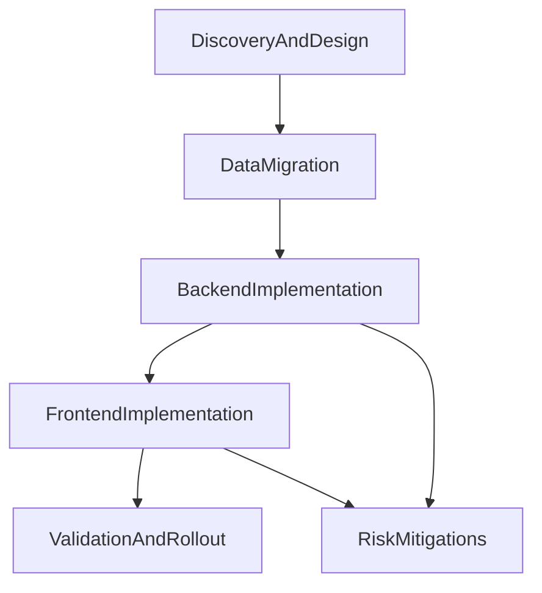

# Nested Filter Logic Tree Upgrade Plan

## Scope And Decisions

- Backend storage: JSONB logic tree in filter set payload (`filters` canonicalized to group+children tree).
- Migration posture: local-dev context, so no strict zero-downtime requirement; still keep compatibility adapters during rollout to reduce churn.
- UX constraints: max tree depth 2, wording uses only `Match ALL` / `Match ANY`, subgroup creation in secondary menu, and no nested boxes (left vertical guide lines only).
- Logic evaluation and visual color priority are separated into independent UI/data flows.

## Current Touchpoints To Update

- Backend schema/query layer: [apps/api/src/schema/ifc_types.py](/home/jovin/projects/BimAtlas/apps/api/src/schema/ifc_types.py), [apps/api/src/schema/queries.py](/home/jovin/projects/BimAtlas/apps/api/src/schema/queries.py), [apps/api/src/db.py](/home/jovin/projects/BimAtlas/apps/api/src/db.py)
- Graph relation execution path used by relation-mode leaves: [apps/api/src/services/graph/age_client.py](/home/jovin/projects/BimAtlas/apps/api/src/services/graph/age_client.py), [apps/api/src/services/graph/queries.py](/home/jovin/projects/BimAtlas/apps/api/src/services/graph/queries.py)
- Frontend protocol/API/UI: [apps/web/src/lib/search/protocol.ts](/home/jovin/projects/BimAtlas/apps/web/src/lib/search/protocol.ts), [apps/web/src/lib/api/client.ts](/home/jovin/projects/BimAtlas/apps/web/src/lib/api/client.ts), [apps/web/src/routes/search/+page.svelte](/home/jovin/projects/BimAtlas/apps/web/src/routes/search/+page.svelte), [apps/web/src/lib/search/AppliedFilterSet.svelte](/home/jovin/projects/BimAtlas/apps/web/src/lib/search/AppliedFilterSet.svelte), [apps/web/src/lib/ui/SearchFilter.svelte](/home/jovin/projects/BimAtlas/apps/web/src/lib/ui/SearchFilter.svelte), [apps/web/src/routes/+page.svelte](/home/jovin/projects/BimAtlas/apps/web/src/routes/+page.svelte)
- DDL/test mirrors: [infra/init-age.sql](/home/jovin/projects/BimAtlas/infra/init-age.sql), [apps/api/tests/conftest.py](/home/jovin/projects/BimAtlas/apps/api/tests/conftest.py), [apps/api/tests/test_filter_sets.py](/home/jovin/projects/BimAtlas/apps/api/tests/test_filter_sets.py)

## Phase 1 — Discovery And Design

- Define canonical logic tree contract (JSON schema + examples):
  - Group node: `{ kind: "group", op: "ALL"|"ANY", children: [...] }`
  - Leaf node: current class/attribute/relation filter shape.
  - Depth rule: `root (0) -> subgroup (1) -> leaf (2 max)`.
- Write API contract note for GraphQL input/output transition:
  - Add tree-aware input while keeping temporary legacy read compatibility.
  - Deprecate `AND/OR` terminology in API docs and UI copy.
- UX wireframe tasks for search modal:
  - Root group selector (`Match ALL` / `Match ANY of the following:`).
  - Primary action: `+ Add Filter Set` (leaf); secondary `⋮` action: `Add Sub-group`.
  - Left-edge colored vertical guide lines for group nesting; no bordered nesting boxes.
- UX wireframe tasks for separation of concerns:
  - Independent flat panel for color/display priority with drag-and-drop ordering.
  - Explicit rule text for overlap precedence.
- Technical spikes:
  - Spike recursive tree-to-SQL clause compilation in backend.
  - Spike Svelte recursive group editor with enforced max depth and keyboard navigation.

## Phase 2 — Data Migration

- Add migration script to canonicalize legacy flat payloads into root groups:
  - Legacy `filters[] + logic` -> `filters = {kind:"group", op:logicMap, children:[...legacyLeaves]}`.
- Update DB bootstrap/test fixtures to tree-first shape in [infra/init-age.sql](/home/jovin/projects/BimAtlas/infra/init-age.sql) and [apps/api/tests/conftest.py](/home/jovin/projects/BimAtlas/apps/api/tests/conftest.py).
- Keep compatibility read adapter in backend during migration period:
  - If `filters` is array, auto-wrap into root group before evaluation.
- Prepare data integrity checks:
  - Find malformed nodes, empty children arrays, invalid depth, invalid mode/operator pairs.
- Run branch-level verification script against existing local data:
  - Compare old vs new matched element counts for representative filter sets.

## Phase 3 — Backend Implementation

- Extend schema types and mutation inputs for expression trees in [apps/api/src/schema/ifc_types.py](/home/jovin/projects/BimAtlas/apps/api/src/schema/ifc_types.py).
- Update GraphQL resolvers in [apps/api/src/schema/queries.py](/home/jovin/projects/BimAtlas/apps/api/src/schema/queries.py):
  - Accept tree payload in create/update/apply flows.
  - Return tree payload consistently.
- Implement central validator module (reused by schema + DB layer):
  - Enforce max depth 2, valid ops (`ALL`/`ANY`), valid leaf schemas, and required fields.
- Refactor evaluation engine in [apps/api/src/db.py](/home/jovin/projects/BimAtlas/apps/api/src/db.py):
  - Replace flat clause concatenation with recursive compiler.
  - Reuse existing leaf builders (`class`, `attribute`, `relation`).
  - Keep relation-mode lookups through graph services unchanged but tree-driven.
- Maintain temporary backward compatibility:
  - Read adapter for legacy arrays.
  - Optional response adapter if any caller still expects flat shape.
- Add/expand tests in [apps/api/tests/test_filter_sets.py](/home/jovin/projects/BimAtlas/apps/api/tests/test_filter_sets.py):
  - Nested ALL/ANY semantics.
  - Depth overflow rejection.
  - Legacy payload compatibility.
  - Relation leaf inside subgroup behavior.

## Phase 4 — Frontend Implementation

- Introduce tree protocol types in [apps/web/src/lib/search/protocol.ts](/home/jovin/projects/BimAtlas/apps/web/src/lib/search/protocol.ts):
  - `FilterLeaf`, `FilterGroup`, `FilterExpression` with discriminated unions.
- Update GraphQL client payloads in [apps/web/src/lib/api/client.ts](/home/jovin/projects/BimAtlas/apps/web/src/lib/api/client.ts) for tree create/update/fetch.
- Build tree editor components:
  - Reuse leaf editor logic from [apps/web/src/lib/ui/SearchFilter.svelte](/home/jovin/projects/BimAtlas/apps/web/src/lib/ui/SearchFilter.svelte).
  - Add `FilterGroupEditor` and nested row rendering in [apps/web/src/routes/search/+page.svelte](/home/jovin/projects/BimAtlas/apps/web/src/routes/search/+page.svelte).
  - Implement left-side vertical indent guides and depth cap enforcement in UI interactions.
- Apply language and interaction updates:
  - Replace all `AND/OR` labels with `Match ALL/Match ANY` text.
  - Keep primary `+ Add Filter Set`; move subgroup creation to secondary `⋮` menu.
- Separate display-order panel from logic builder:
  - Add flat drag-and-drop panel for applied sets (color precedence only).
  - Remove implicit dependence on API-return order for visual precedence.
- Update applied-set summaries in [apps/web/src/lib/search/AppliedFilterSet.svelte](/home/jovin/projects/BimAtlas/apps/web/src/lib/search/AppliedFilterSet.svelte) to tree-readable summaries.
- Update viewer-side consumption in [apps/web/src/routes/+page.svelte](/home/jovin/projects/BimAtlas/apps/web/src/routes/+page.svelte):
  - Stop flattening nested logic for transport where backend supports tree evaluation.
  - Keep a temporary adapter only if needed during transition.

## Phase 5 — Validation And Rollout

- Backend validation:
  - Run API tests for nested logic operators and migration fixtures.
  - Add regression checks for relation filters and existing saved sets.
- Frontend validation:
  - Manual QA matrix for depth cap, add/remove subgroup, copy edits, and visual line indentation behavior.
  - Verify display-order panel changes color precedence without altering logic results.
- End-to-end checks:
  - Compare representative scenarios: `ALL(A,B) OR ANY(C,D)` and mixed relation/attribute/class leaves.
  - Confirm no branch data loss after migration script.
- Cleanup:
  - Remove legacy adapters once all stored data and clients are tree-native.

## Risks And Mitigations

- Risk: semantic regressions in nested SQL compilation.
  - Mitigation: golden tests comparing expected element IDs for known trees; keep legacy parity tests during transition.
- Risk: malformed or partially migrated JSON payloads.
  - Mitigation: strict validator at API and DB boundaries + one-time canonicalization check script.
- Risk: UX confusion when logic editing and color ordering are both present.
  - Mitigation: isolate into two panels with explicit helper text and independent save/preview feedback.
- Risk: horizontal space pressure in deep logic editors.
  - Mitigation: max depth 2 + vertical guide lines + compact row actions.
- Risk: terminology mismatch (`AND/OR` remnants in code or UI).
  - Mitigation: copy audit pass and snapshot tests for key labels before release.

