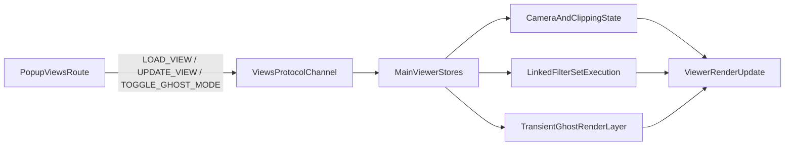

# Saved Views (BCF-Compliant) Implementation Plan

## Scope and Constraints

- Keep saved-view state out of IFC core storage; persist only in app-level tables.
- Model camera/clipping payloads to BCF viewpoint-compatible JSON shape.
- Ensure cross-tab messages are structured-clone safe before posting.
- Keep ghost-mode as runtime-only viewer state (never persisted).

## Data Model and Migration

- Add migration SQL in [infra/migrations](/home/jovin/projects/BimAtlas/infra/migrations) to create:
  - `app_views` (`id`, `name`, `created_at`, `updated_at`, `bcf_camera_state JSONB`, `ui_filters JSONB`).
  - `view_filter_sets` (`view_id`, `filter_set_id`) with PK/unique and FKs to `app_views` and existing filter-sets table.
- Add indexes for common reads:
  - `view_filter_sets(view_id)` and `view_filter_sets(filter_set_id)`.
  - optional GIN on `app_views.bcf_camera_state` only if query patterns require it.
- Apply the migration through [infra/run_migrations.sh](/home/jovin/projects/BimAtlas/infra/run_migrations.sh) to stay consistent with existing infra-driven schema evolution.

## Backend API and Aggregation

- Extend persistence/service layer under [apps/api/src](/home/jovin/projects/BimAtlas/apps/api/src) with view CRUD helpers and attach/detach filter-set functions.
- Add API schema/resolvers (GraphQL-first if existing pattern dominates) to:
  - Create/update/delete/list/get saved views.
  - Return aggregated `SavedView` payload for read/get: view fields + resolved linked filter-set definitions in one response.
- Add input validation for BCF camera payload shape:
  - Accept `perspective_camera` or `orthogonal_camera` and `clipping_planes` collection.
  - Reject malformed camera vectors/required fields early with clear error messages.

## Frontend Popup Route and UI

- Add dedicated views popup route in [apps/web/src/routes](/home/jovin/projects/BimAtlas/apps/web/src/routes) (new `/views` route/layout) using existing popup layout conventions.
- Implement UI components in [apps/web/src/lib](/home/jovin/projects/BimAtlas/apps/web/src/lib):
  - View list (select, rename, delete).
  - View editor form (name, camera/clipping preview state, linked filter sets).
  - Filter-set attachment controls using existing filter-set selectors/stores.

## Cross-Tab Protocol and Viewer Execution

- Introduce protocol module (similar to other popup protocols) in [apps/web/src/lib](/home/jovin/projects/BimAtlas/apps/web/src/lib) with message types:
  - `LOAD_VIEW`, `UPDATE_VIEW`, `TOGGLE_GHOST_MODE`.
- Enforce cloneable payload dispatch:
  - `const clone = JSON.parse(JSON.stringify(message)); channel.postMessage(clone);`
- In main viewer flow (`/` route and related stores), enforce one-active-view semantics:
  - Loading a view replaces previous camera, clipping planes, and visibility context atomically.
  - Apply resolved linked filter sets after camera/clipping state is staged to avoid visual race conditions.

## Ghost Mode Runtime Layer

- Add transient ghost-state store keyed by entity identifiers in [apps/web/src/lib](/home/jovin/projects/BimAtlas/apps/web/src/lib).
- On `TOGGLE_GHOST_MODE`, override targeted materials to low opacity/desaturated style instead of hiding.
- Keep ghost-state separate from persisted view payload; clear/recompute on view switch.

## Testing and Validation

- Backend tests in [apps/api/tests](/home/jovin/projects/BimAtlas/apps/api/tests):
  - Migration existence and schema assertions.
  - CRUD + aggregated read behavior.
  - Invalid BCF payload rejection.
  - Guarantee ghost flags are not stored.
- Migration verification should assert the applied SQL version exists under [infra/migrations](/home/jovin/projects/BimAtlas/infra/migrations) and the resulting tables/constraints are present in PostgreSQL.
- Frontend tests in [apps/web](/home/jovin/projects/BimAtlas/apps/web):
  - Protocol serialization and message handling.
  - Active-view mutual exclusivity.
  - Ghost-mode visual-state toggling and reset on view change.
- Final verification run:
  - API tests with virtualenv active.
  - Frontend check/tests.
  - Manual acceptance pass: open popup, load view, verify camera/clipping/filter effects, toggle ghost mode, confirm no DB persistence of ghost overrides.

## Execution Flow Diagram

