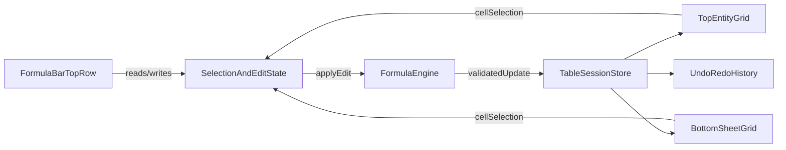

# Table Spreadsheet Utilities Plan

## Goal

Add intermediate spreadsheet utilities to the existing table popup, including a top formula bar (selected cell reference + editable input), keyboard-driven cell interactions, fill handle, and undo/redo across both the top entity grid and bottom sheet while preserving protected-column constraints.

## Scope and Constraints

- Build on the existing table popup feature in [apps/web/src/routes/table/+page.svelte](/home/jovin/projects/BimAtlas/apps/web/src/routes/table/+page.svelte).
- Use current filtered stream output as source of truth for entities (`searchState.products`); do not re-run filter logic in popup.
- Keep geometry opaque (no BYTEA parsing/exposure in UI).
- Preserve protected columns (for example `IfcClass`) as non-editable even when formula bar is active.
- Keep state session/local in v1 unless product requirements are updated.

## Implementation Steps

- **Define interaction contract:** Extend table interaction model in [apps/web/src/lib/table/engine.ts](/home/jovin/projects/BimAtlas/apps/web/src/lib/table/engine.ts) (or adjacent state module) to track `activeCell`, `selectionRange`, `formulaInput`, edit mode, and history stack (undo/redo) for both surfaces.
- **Add formula bar UI shell:** Add a top toolbar row in [apps/web/src/routes/table/+page.svelte](/home/jovin/projects/BimAtlas/apps/web/src/routes/table/+page.svelte) with: cell reference display (e.g. `B7`), editable input field, commit/cancel actions, and disabled/read-only state messaging for protected cells.
- **Wire global selection semantics:** Update table components under [apps/web/src/lib/table/](/home/jovin/projects/BimAtlas/apps/web/src/lib/table/) so whichever cell is selected (top or bottom surface) becomes the formula bar target; blur/surface switch should persist consistent active selection.
- **Enable formula evaluation layer:** Implement intermediate formula support (`=A1+B1`, `SUM(range)`, direct refs) in a dedicated utility module under [apps/web/src/lib/table/](/home/jovin/projects/BimAtlas/apps/web/src/lib/table/), with validation and safe error states (`#ERROR`, `#REF`) that never mutate protected fields.
- **Implement keyboard navigation and editing:** Add spreadsheet-like keyboard behavior (arrow navigation, Enter/Tab traversal, F2 or equivalent edit mode, Esc cancel) across both surfaces; ensure row lock/unlock and protected-column checks are enforced before commit.
- **Add fill handle behavior:** Implement drag or handle-based autofill for supported series/formulas in editable cells only; reject fills into protected or locked targets with clear UI feedback.
- **Add undo/redo history:** Add action history for edits, fills, and formula commits (keyboard shortcuts and toolbar affordances if present), scoped to popup session.
- **Update protocol/test harness if needed:** If popup context protocol requires extra state sync for deterministic tests, update [apps/web/src/lib/table/protocol.ts](/home/jovin/projects/BimAtlas/apps/web/src/lib/table/protocol.ts) and fixture mode to inject controlled selection/formula scenarios.
- **Add/expand tests:** Extend isolated tests under [apps/web/tests/table-spreadsheet/](/home/jovin/projects/BimAtlas/apps/web/tests/table-spreadsheet/) to cover formula bar reflection of selected cell, formula commit, protected-cell blocking, keyboard navigation, fill handle behavior, and undo/redo.
- **Verification (final):** Run frontend checks and spreadsheet suite (`pnpm run check`, spreadsheet tests in headless and headed Chromium), then record any constraints/pitfalls in feature docs before handoff.

## Architecture Flow

## Primary Files

- [apps/web/src/routes/table/+page.svelte](/home/jovin/projects/BimAtlas/apps/web/src/routes/table/+page.svelte)
- [apps/web/src/lib/table/engine.ts](/home/jovin/projects/BimAtlas/apps/web/src/lib/table/engine.ts)
- [apps/web/src/lib/table/protocol.ts](/home/jovin/projects/BimAtlas/apps/web/src/lib/table/protocol.ts)
- [apps/web/src/lib/table/](/home/jovin/projects/BimAtlas/apps/web/src/lib/table/)
- [apps/web/tests/table-spreadsheet/](/home/jovin/projects/BimAtlas/apps/web/tests/table-spreadsheet/)
